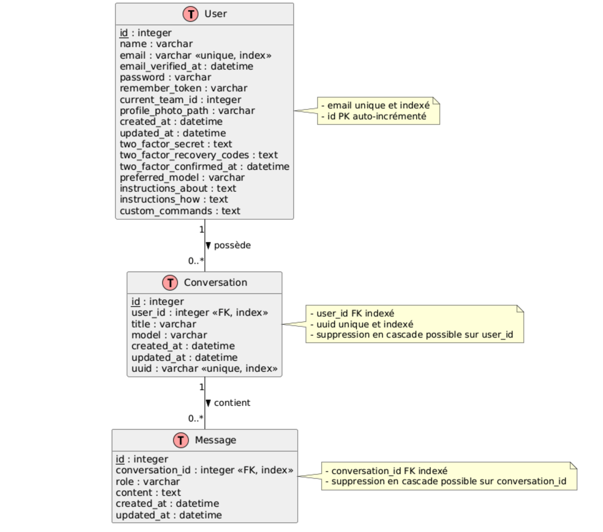
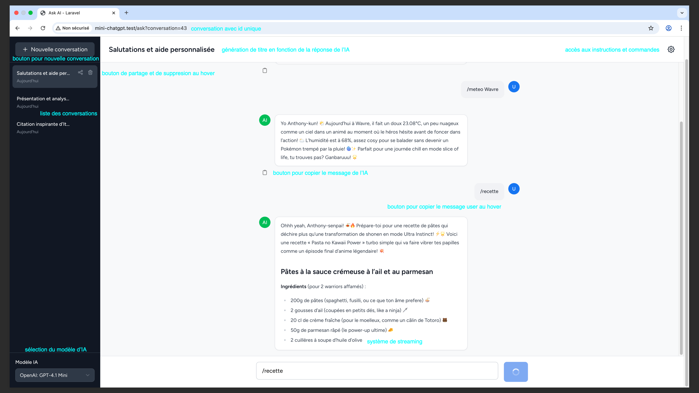
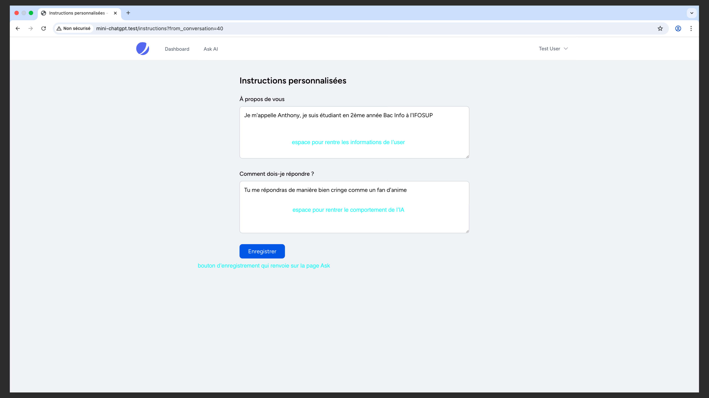
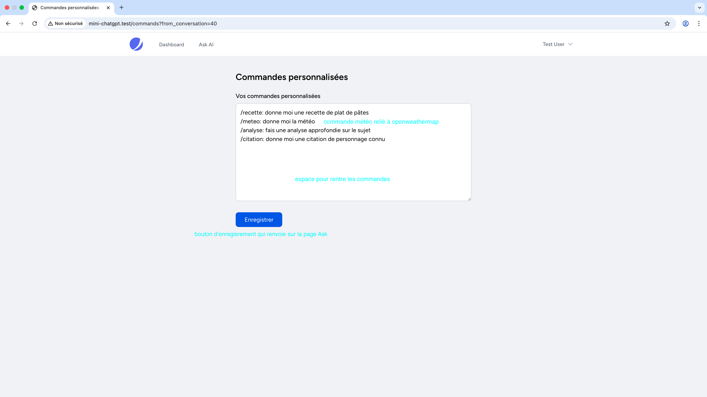
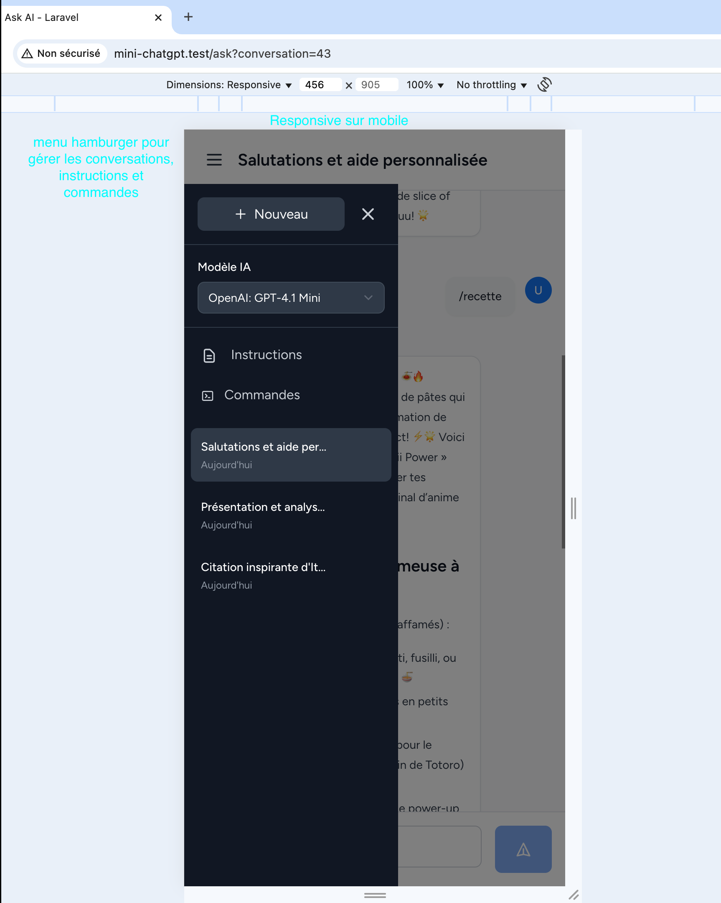

  

    <strong>CHANG Zhi-Ho Anthony</strong>
  

  

    
2024-2025

    
5IDV3-1 Projet de développement SGBD

    
IFOSUP

  

  <h1 style="font-size: 2.5em; font-weight: bold;">Mini ChatGPT - Rapport de Projet</h1>

# Introduction

## Contexte et objectifs

Le projet Mini ChatGPT vise à développer une application de chat conversationnel intelligente inspirée de ChatGPT, permettant aux utilisateurs d'interagir avec une intelligence artificielle via une interface simple et intuitive. L'objectif principal est de fournir une expérience utilisateur fluide avec la gestion de multiples conversations, la personnalisation des interactions, et la possibilité de partager les échanges.

Ce projet s'inscrit dans une volonté d'explorer les technologies modernes de développement web, notamment Laravel pour le backend et Vue.js pour le frontend, tout en intégrant des services d'IA avancés pour le traitement du langage naturel.

Les objectifs spécifiques incluent :

-   La création d'une interface utilisateur réactive et accessible sur différents appareils
-   La gestion efficace des conversations multiples avec une persistance des données
-   L'intégration d'un système de commandes personnalisées pour enrichir l'expérience
-   La mise en place d'un système de partage sécurisé des conversations

## Périmètre du projet

Le périmètre du projet Mini ChatGPT couvre le développement complet d'une application web de chat basée sur une architecture moderne. Il inclut la conception et la mise en œuvre du backend avec Laravel, la création d'une interface utilisateur dynamique avec Vue.js et Inertia.js, ainsi que l'intégration de services d'intelligence artificielle pour le traitement des messages.

Le projet englobe :

-   La gestion des utilisateurs et de leur authentification
-   La création, la modification, la suppression et la navigation entre plusieurs conversations
-   La gestion des messages échangés entre l'utilisateur et l'IA
-   La personnalisation des interactions via des commandes et instructions spécifiques
-   La possibilité de partager des conversations via des liens uniques

Le périmètre exclut pour l'instant des fonctionnalités avancées telles que l'intégration multi-utilisateurs en temps réel ou la gestion de fichiers multimédias.

## Technologies utilisées

Le projet Mini ChatGPT utilise un ensemble de technologies modernes et performantes pour assurer une expérience utilisateur optimale et une architecture robuste.

### Backend

-   **Laravel 11** : Framework PHP moderne pour la gestion des API, de la base de données et de la logique métier
-   **SQLite** : Base de données légère et facile à configurer, adaptée au développement et aux tests
-   **Inertia.js** : Permet de créer des applications monoplates en combinant Laravel et Vue.js

### Frontend

-   **Vue.js 3 avec Composition API** : Framework JavaScript pour construire une interface utilisateur réactive et modulaire
-   **Tailwind CSS** : Framework CSS utilitaire pour un design rapide et responsive
-   **Vite** : Outil de build moderne pour un développement rapide
-   **Highlight.js** : Bibliothèque pour la coloration syntaxique dans le rendu Markdown

### Services et architecture

-   Services métier dédiés (ChatService, ConversationService, CustomCommandService) pour une séparation claire des responsabilités
-   Utilisation de traits réutilisables pour la gestion des identifiants uniques

## 2. Architecture et Conception

### 2.1 Base de données

#### Diagramme UML

#### Explication des tables et relations

La base de données du projet Mini ChatGPT est structurée autour de trois entités principales qui forment le cœur du système conversationnel :

**Table User**
La table `User` constitue l'entité centrale du système d'authentification et de personnalisation. Elle contient les informations essentielles de l'utilisateur ainsi que ses préférences personnalisées :

-   Les champs d'authentification standards (name, email, password, remember_token)
-   Les fonctionnalités de sécurité avancées avec l'authentification à deux facteurs (two_factor_secret, two_factor_recovery_codes, two_factor_confirmed_at)
-   Les préférences utilisateur spécifiques au chat : `preferred_model` pour le modèle d'IA préféré, `instructions_about` et `instructions_how` pour personnaliser le comportement de l'IA, et `custom_commands` pour les commandes personnalisées

**Table Conversation**
La table `Conversation` représente une session de chat entre l'utilisateur et l'IA. Chaque conversation est caractérisée par :

-   Un titre descriptif généré automatiquement ou défini par l'utilisateur
-   Le modèle d'IA utilisé pour cette conversation spécifique
-   Un UUID unique permettant le partage sécurisé des conversations
-   Les timestamps de création et de mise à jour pour le suivi temporel

**Table Message**
La table `Message` stocke l'historique complet des échanges conversationnels :

-   Le rôle du message ('user' pour les messages de l'utilisateur, 'assistant' pour les réponses de l'IA)
-   Le contenu textuel complet du message
-   Les timestamps pour maintenir l'ordre chronologique des échanges

#### Contraintes et règles d'intégrité

Le modèle de données respecte plusieurs contraintes d'intégrité essentielles pour garantir la cohérence et la sécurité des données :

**Contraintes de clés primaires**

-   Chaque table possède une clé primaire auto-incrémentée (`id`) garantissant l'unicité de chaque enregistrement

**Contraintes d'unicité**

-   L'email dans la table `User` est unique et indexé, empêchant la création de comptes multiples avec la même adresse
-   L'UUID dans la table `Conversation` est unique et indexé, assurant l'unicité des liens de partage

**Contraintes de clés étrangères**

-   `user_id` dans la table `Conversation` référence la clé primaire de `User` avec une contrainte d'intégrité référentielle
-   `conversation_id` dans la table `Message` référence la clé primaire de `Conversation`

**Règles de suppression en cascade**

-   La suppression d'un utilisateur entraîne automatiquement la suppression de toutes ses conversations (ON DELETE CASCADE sur user_id)
-   La suppression d'une conversation entraîne automatiquement la suppression de tous ses messages (ON DELETE CASCADE sur conversation_id)

**Contraintes de validation**

-   Les champs `role` dans la table `Message` sont contraints aux valeurs 'user' ou 'assistant'
-   Les champs email respectent le format d'adresse électronique valide
-   Les champs obligatoires (NOT NULL) garantissent la présence des données essentielles

### 2.2 Architecture logicielle

#### Organisation du code Laravel

Le code Laravel du projet Mini ChatGPT est organisé selon les bonnes pratiques MVC (Modèle-Vue-Contrôleur) avec une séparation claire des responsabilités :

**Contrôleurs (app/Http/Controllers)** : Gèrent les requêtes HTTP, orchestrent la logique métier via les services, et retournent les réponses (souvent via Inertia.js). Par exemple, `AskController` gère les actions liées au chat, comme la création, la suppression de conversations, et l'envoi de messages.

**Modèles (app/Models)** : Représentent les entités de la base de données (User, Conversation, Message) avec Eloquent ORM, définissant les relations et les règles métier associées.

**Services (app/Services)** : Contiennent la logique métier complexe et réutilisable, comme `ConversationService` pour la gestion des conversations, `ChatService` pour l'interaction avec l'API IA, et `CustomCommandService` pour le traitement des commandes personnalisées.

**Traits (app/Traits)** : Fournissent des fonctionnalités réutilisables, par exemple pour la gestion des UUID.

**Migrations (database/migrations)** : Définissent la structure de la base de données et les évolutions du schéma.

**Tests (tests/Feature et tests/Unit)** : Contiennent les tests fonctionnels et unitaires pour assurer la qualité et la stabilité du code.

Cette organisation permet une maintenance aisée, une évolutivité et une séparation claire entre la logique métier, la gestion des données et la présentation.

#### Structure des composants Vue.js

La structure des composants Vue.js dans le projet Mini ChatGPT est organisée de manière modulaire et claire pour faciliter la maintenance et l'évolution :

**Pages (resources/js/Pages/Ask)** : Contient le composant principal `Index.vue` qui orchestre l'ensemble de l'interface de chat.

**Composants enfants (resources/js/Pages/Ask/Components)** :

-   `Sidebar.vue` : Gère la navigation entre les conversations, la création de nouvelles conversations, et la sélection du modèle IA
-   `ChatHeader.vue` : Affiche l'en-tête du chat avec les contrôles de menu et paramètres
-   `MessagesList.vue` : Affiche la liste des messages dans la conversation sélectionnée, avec support du streaming et du rendu Markdown
-   `MessageInput.vue` : Zone de saisie des messages, gérant le focus, la saisie, et l'envoi
-   `ErrorDisplay.vue` : Affiche les erreurs liées à la saisie ou au serveur

**Layout (resources/js/Layouts/AppLayout.vue)** : Fournit la structure globale de la page, intégrant Inertia.js et les styles.

**Utilisation de Composition API** : Tous les composants utilisent la Composition API de Vue 3 pour une meilleure organisation du code et réutilisabilité.

**Gestion des états locaux** : Les états comme la conversation sélectionnée, le modèle courant, et les messages sont gérés via des refs et computed properties dans `Index.vue`.

**Communication entre composants** : Utilisation d'événements personnalisés (`emit`) pour la communication entre `Sidebar`, `MessageInput` et `Index.vue`.

Cette structure favorise la clarté, la modularité et la réutilisation des composants.

#### Services et patterns utilisés

Le projet Mini ChatGPT utilise plusieurs services métier pour organiser la logique complexe et favoriser la réutilisabilité :

**ChatService** : Gère la communication avec l'API d'intelligence artificielle, en particulier l'envoi des messages et la gestion du streaming des réponses.

**ConversationService** : Responsable de la gestion des conversations, incluant la création, la suppression, la récupération des conversations de l'utilisateur, et la gestion des UUID pour le partage.

**CustomCommandService** : Traite les commandes personnalisées entrées par l'utilisateur, permettant d'étendre les fonctionnalités du chat avec des commandes spécifiques.

**TitleGeneratorService** : Génère automatiquement des titres pertinents pour les conversations basés sur le contenu échangé.

**Patterns utilisés** :

-   **Service Layer** : La logique métier est encapsulée dans des services dédiés, séparant la logique métier du contrôleur et facilitant les tests
-   **Repository Pattern (partiel)** : Bien que non explicitement nommé, les services agissent comme des intermédiaires entre les contrôleurs et les modèles, centralisant les accès aux données
-   **Trait Reusable** : Utilisation de traits pour des fonctionnalités transversales comme la gestion des UUID
-   **Inertia.js** : Utilisé pour la communication entre backend Laravel et frontend Vue.js, facilitant la création d'applications SPA
-   **Composition API de Vue 3** : Pour une meilleure organisation et réutilisation du code frontend

## 3. Fonctionnalités développées

## 💬 Page de Chat Principale

### Conversation avec IA unique

La page principale affiche une **conversation individuelle** avec l'IA, offrant :

-   **Historique complet** des échanges entre l'utilisateur et l'assistant
-   **Affichage chronologique** des messages avec distinction visuelle (utilisateur vs IA)
-   **Rendu Markdown** pour les réponses formatées de l'IA
-   **Streaming en temps réel** des réponses de l'IA

### Génération de titre en fonction de la réponse de l'IA

Le système génère automatiquement des **titres pertinents** pour chaque conversation :

-   **Analyse du contenu** des premiers échanges pour créer un titre descriptif
-   **Mise à jour automatique** du titre dans la sidebar après les premières interactions
-   **Titres contextuels** qui reflètent le sujet principal de la conversation

### Bouton pour partage et suppression au hover

Chaque conversation dans la sidebar dispose de **contrôles contextuels** :

-   **Boutons d'action** qui apparaissent au survol de la souris
-   **Fonction de partage** générant un lien unique (UUID) pour partager la conversation
-   **Suppression sécurisée** avec confirmation avant suppression définitive
-   **Interface intuitive** cachant les actions secondaires pour éviter l'encombrement

### Accès aux instructions et commandes

Navigation rapide vers les pages de configuration :

-   **Liens directs** vers la page d'instructions personnalisées
-   **Accès aux commandes** personnalisées depuis l'interface principale
-   **Retour contextuel** vers la conversation d'origine après modification

### Sélection du modèle d'IA

Interface de **sélection de modèle** intégrée :

-   **Dropdown** avec liste des modèles disponibles (GPT-4, GPT-3.5-turbo, etc.)
-   **Changement en temps réel** du modèle pour la conversation courante
-   **Sauvegarde des préférences** utilisateur pour les nouvelles conversations

### Système de streaming

**Affichage en temps réel** des réponses de l'IA :

-   **Streaming progressif** du texte au fur et à mesure de la génération
-   **Indicateurs visuels** de progression et d'état de génération
-   **Expérience fluide** similaire à ChatGPT avec affichage mot par mot

## 📝 Page des Instructions Personnalisées

### Espace pour mettre les informations de l'user

Section **"À propos de vous"** :

-   **Champ de texte libre** pour décrire le profil, les préférences, le contexte personnel
-   **Informations contextuelles** que l'IA utilisera pour personnaliser ses réponses
-   **Données persistantes** sauvegardées dans le profil utilisateur

### Espace pour définir le comportement de l'IA

Section **"Comment dois-je répondre ?"** :

-   **Configuration du style** de réponse de l'IA (formel, décontracté, technique, etc.)
-   **Directives comportementales** pour adapter le ton et l'approche de l'assistant
-   **Personnalisation avancée** du comportement conversationnel

### Bouton d'enregistrement qui renvoie sur la page Ask

**Système de sauvegarde** identique aux commandes :

-   **Validation et sauvegarde** des instructions personnalisées
-   **Retour automatique** à l'interface de chat
-   **Application immédiate** des nouvelles instructions aux conversations suivantes
-   **Persistance** des paramètres pour toutes les futures interactions

## ⚙️ Page des Commandes Personnalisées

### Espace pour rendre les commandes

Zone de **configuration des commandes slash** :

-   **Textarea** pour définir les commandes personnalisées (ex: /recette, /meteo, /analyse)
-   **Syntaxe simple** pour créer des raccourcis personnalisés
-   **Sauvegarde persistante** des commandes dans le profil utilisateur

### Bouton d'enregistrement qui renvoie sur la page Ask

**Workflow de configuration** optimisé :

-   **Bouton "Enregistrer"** pour valider les modifications
-   **Redirection automatique** vers la page de chat après sauvegarde
-   **Confirmation visuelle** de la prise en compte des changements
-   **Intégration immédiate** des nouvelles commandes dans le chat

## 📱 Interface Mobile Responsive

### Menu hamburger pour gérer les conversations, instructions et commandes

L'interface mobile intègre un **menu hamburger** accessible via l'icône trois barres horizontales, permettant d'accéder facilement à toutes les fonctionnalités principales sur petit écran. Ce menu contient :

-   La liste des conversations existantes avec navigation tactile
-   L'accès aux instructions personnalisées
-   La gestion des commandes personnalisées
-   Le sélecteur de modèle IA adapté au mobile

### Responsive sur mobile

L'application s'adapte parfaitement aux écrans mobiles avec :

-   **Sidebar rétractable** qui se transforme en overlay plein écran
-   **Navigation tactile optimisée** pour les interactions au doigt
-   **Disposition verticale** des éléments pour une meilleure lisibilité
-   **Boutons et zones de saisie agrandis** pour faciliter l'interaction tactile

---

### Défis techniques et solutions

**1. Intégration du streaming des réponses de l’IA**  
**Défi :**  
Mettre en place un affichage en temps réel des réponses de l’IA, pour une expérience utilisateur fluide similaire à ChatGPT.  
**Solution appliquée :**  
Utilisation de la méthode `fetch` avec `ReadableStream` pour recevoir les réponses de l’IA par morceaux. Chaque morceau est ajouté progressivement à la conversation, ce qui permet un affichage dynamique et immédiat. La gestion des erreurs et des indicateurs visuels complète l’expérience utilisateur.

**2. Retour sur la conversation utilisateur après modification des instructions ou commandes**  
**Défi :**  
Après avoir modifié ses instructions ou commandes personnalisées, l’utilisateur doit revenir exactement à la conversation qu’il consultait, au même endroit sur la page.  
**Solution appliquée :**  
Utilisation des messages flash de Laravel pour transmettre l’identifiant de la conversation sélectionnée et un indicateur de focus. Un watcher côté Vue détecte ces informations et restaure automatiquement la sélection de la conversation ainsi que la position de scroll, assurant une continuité fluide de l’expérience utilisateur après chaque redirection.

## 5. Tests et Qualité

### Stratégie de tests

La stratégie de tests du projet Mini ChatGPT repose sur une combinaison de tests fonctionnels (Feature tests) et de tests unitaires (Unit tests) pour assurer la qualité et la stabilité de l'application. Les tests fonctionnels vérifient le bon fonctionnement des principales fonctionnalités utilisateur, notamment l'accès à la page de chat et la création de conversations. Les tests unitaires se concentrent sur la logique métier encapsulée dans les services, garantissant que les composants critiques fonctionnent comme prévu.

Cette approche permet de détecter rapidement les régressions et d'assurer une couverture suffisante des cas d'usage essentiels, tout en facilitant la maintenance et l'évolution du code.

### Tests Dusk implémentés

Le projet Mini ChatGPT ne dispose actuellement pas de tests Dusk pour les tests end-to-end automatisés du navigateur. Cependant, il inclut plusieurs tests fonctionnels et unitaires importants qui contribuent significativement à la qualité du code.

Parmi les tests fonctionnels, on trouve :

-   **ChatPageAccessTest** : vérifie que l'utilisateur authentifié peut accéder à la page de chat et que le composant Inertia est correctement rendu
-   **ConversationCreationTest** : assure que l'utilisateur peut créer une nouvelle conversation, avec persistance en base de données et redirection appropriée

Un test unitaire notable est :

-   **ConversationServiceTest** : teste la logique métier de création de conversation, notamment l'association correcte de l'utilisateur, du titre et du modèle

Ces tests utilisent le trait RefreshDatabase pour garantir un environnement isolé et propre à chaque exécution, assurant ainsi la fiabilité des résultats.

### Résultats

Les tests existants dans le projet Mini ChatGPT passent avec succès, ce qui témoigne de la stabilité et de la robustesse des fonctionnalités principales. L'exécution régulière de ces tests permet de détecter rapidement toute régression ou anomalie introduite lors des développements.

Bien que les tests Dusk ne soient pas encore implémentés, la couverture fonctionnelle et unitaire actuelle offre une base solide pour garantir la qualité du code. Ces tests facilitent également la maintenance et l'évolution du projet en assurant que les modifications n'affectent pas négativement les fonctionnalités critiques.

L'intégration future de tests Dusk pourrait compléter cette stratégie en ajoutant une couche de tests end-to-end automatisés, simulant le comportement réel de l'utilisateur dans un navigateur.

## 6. Difficultés et Solutions

### Problèmes rencontrés

**1. Implémentation du streaming des réponses de l'IA**

L'un des défis majeurs du projet a été l'intégration du streaming pour afficher les réponses de l'IA en temps réel. La difficulté résidait dans la gestion des flux de données asynchrones côté frontend, tout en maintenant une interface utilisateur réactive et en gérant les erreurs potentielles de connexion. Il fallait également s'assurer que l'affichage progressif des réponses ne compromette pas les performances de l'application ni la stabilité de l'interface utilisateur.

**2. Retour contextuel après modification des instructions et commandes**

Un problème significatif concernait la navigation utilisateur : après avoir modifié ses instructions personnalisées ou ses commandes, l'utilisateur était redirigé vers la conversation la plus récente au lieu de retourner à la conversation qu'il consultait initialement. Cette rupture dans l'expérience utilisateur créait une perte de contexte et une frustration, particulièrement lors de sessions de travail prolongées avec plusieurs conversations actives.

**3. Suppression accidentelle de la base de données lors des tests**

Durant la phase de développement et de tests, un incident critique s'est produit : l'exécution de la commande `php artisan migrate:fresh --env=testing` a entraîné la suppression complète de la base de données de développement. Cette commande, destinée à l'environnement de test, a eu pour effet de vider entièrement la base de données, supprimant toutes les tables et données existantes. Malgré les tentatives de restauration avec les migrations standard, la base de données ne se repeuplait pas correctement, laissant l'application dans un état non fonctionnel sans données de test ni contenu de développement.

### Solutions apportées

**1. Streaming des réponses IA**

La solution implémentée utilise l'API Fetch avec ReadableStream pour gérer le flux de données en temps réel. Côté backend, Laravel retourne une réponse en streaming via `response()->stream()`, permettant d'envoyer les données par chunks. Côté frontend, Vue.js traite chaque morceau reçu et l'affiche progressivement dans l'interface, créant une expérience utilisateur fluide similaire à ChatGPT. La gestion d'erreurs robuste assure la stabilité même en cas de problème de connexion.

**2. Système de retour contextuel**

La solution mise en place repose sur l'utilisation d'identifiants uniques (UUID) pour chaque conversation et un système de messages flash Laravel pour maintenir le contexte. Lors de la redirection vers les pages d'instructions ou de commandes, l'ID de la conversation courante est transmis via les paramètres d'URL et stocké dans les messages flash. Au retour, le système utilise ces informations pour restaurer automatiquement la sélection de la conversation précédente et repositionner l'utilisateur au bon endroit dans l'interface, préservant ainsi la continuité de l'expérience utilisateur.

**3. Récupération de la base de données**

Face à l'impossibilité de restaurer automatiquement la base de données après la commande destructive, la solution d'urgence a consisté à supprimer manuellement le fichier SQLite corrompu et à implémenter une copie de sauvegarde fournie par un collègue. Cette approche a permis de restaurer rapidement un environnement de développement fonctionnel avec des données de test appropriées.

### Ce qui pourrait être amélioré

Plusieurs pistes d'évolution peuvent être envisagées pour renforcer la qualité, la robustesse et l'expérience utilisateur du projet Mini ChatGPT :

### **Améliorations techniques de base**

-   **Améliorer la gestion du focus automatique** : Pour garantir une expérience utilisateur fluide, il serait pertinent d'optimiser la gestion du focus sur la zone de saisie, notamment après la création ou la suppression de conversations.
-   **Mettre en place des tests end-to-end (Dusk)** : L'ajout de tests Dusk permettrait de vérifier le bon fonctionnement des scénarios utilisateur complets directement dans le navigateur, renforçant ainsi la stabilité de l'interface.
-   **Optimiser la gestion des messages en attente** : Remplacer la dépendance au localStorage par une solution plus robuste et maintenable améliorerait la gestion des messages en attente lors de la création de nouvelles conversations.

### **Évolutions fonctionnelles avancées**

-   **Intégrer un système d'outils (Tools) pour LLM** : Implémenter une architecture de tools permettrait d'étendre les capacités de l'IA au-delà de la simple génération de texte. Cela inclurait des outils de recherche web, de calcul, d'analyse de documents, ou encore de génération d'images, transformant l'application en véritable assistant polyvalent.
-   **Développer un système d'agents autonomes** : Créer des agents spécialisés capables d'exécuter des tâches complexes de manière autonome, avec une boucle de réflexion-action-observation, permettrait d'automatiser des workflows complets.
-   **Ajouter une gestion multi-utilisateurs en temps réel** : L'intégration d'une gestion collaborative, permettant à plusieurs utilisateurs de participer à une même conversation en temps réel, ouvrirait de nouvelles possibilités d'utilisation.

### **Améliorations de l'expérience utilisateur**

-   **Intégrer la gestion des fichiers multimédias** : L'ajout du support des images, fichiers audio ou autres médias enrichirait l'expérience de chat et la rendrait plus polyvalente.
-   **Implémenter un système de mémoire persistante** : Développer un outil de mémoire permettant à l'IA de sauvegarder, récupérer et rechercher des informations contextuelles améliorerait la continuité des conversations.
-   **Optimiser la performance du streaming et la gestion des erreurs réseau** : Renforcer la résilience du système de streaming avec des générateurs PHP et une gestion d'événements JSON améliorerait l'expérience utilisateur même en cas de connexion instable.

### **Architecture et maintenance**

-   **Mettre en place une stratégie de sauvegarde automatique** : Pour éviter toute perte accidentelle de données, il serait judicieux d'automatiser la sauvegarde et la restauration de la base de données.
-   **Refactoriser le watcher complexe** : Simplifier et clarifier le code du watcher qui gère la synchronisation des données améliorerait la lisibilité et la maintenabilité du frontend.
-   **Améliorer la documentation et les messages d'erreur** : Une documentation plus complète et des messages d'erreur plus explicites faciliteraient la maintenance et l'utilisation du projet.

### **Évolutions vers l'intelligence artificielle avancée**

-   **Créer des agents spécialisés** : Développer des agents pour des domaines spécifiques (agent web browser, agent développeur, agent de recherche) qui pourraient collaborer entre eux pour résoudre des tâches complexes.
-   **Implémenter un ToolManager centralisé** : Mettre en place une architecture de gestion des outils avec une interface standardisée (ToolInterface) permettrait d'ajouter facilement de nouveaux outils sans modifier le code existant.
-   **Intégrer des capacités de raisonnement avancées** : Utiliser les derniers modèles comme o3-mini pour des tâches nécessitant un raisonnement complexe et une résolution de problèmes étape par étape.

## 7. Utilisation des outils IA

### Outils utilisés

Le développement du projet Mini ChatGPT a bénéficié de l'assistance de plusieurs outils d'intelligence artificielle de pointe :

-   **Perplexity avec Claude 4.0** : Utilisé comme assistant principal pour la rédaction du rapport et l'assistance au développement
-   **GPT-4.1** : Employé spécifiquement pour la génération du diagramme UML de la base de données

### Comment ?

L'utilisation de ces outils IA s'est intégrée de manière pragmatique dans le workflow de développement. **Avec Claude 4.0 via Perplexity**, une approche conversationnelle a été adoptée : présentation des problèmes techniques concrets, partage d'extraits de code, et description des comportements inattendus rencontrés. L'outil permettait d'obtenir des explications détaillées, des suggestions de correction, et des alternatives d'implémentation.

Le processus typique consistait à décrire le contexte du problème avec des exemples concrets, partager les fichiers de code concernés pour une analyse précise, tester les solutions proposées et itérer jusqu'à obtenir une solution fonctionnelle.

Pour **GPT-4.1**, une approche directe et ciblée a été utilisée : fourniture de la structure de la base de données (tables, champs, relations) avec demande de génération du code PlantUML correspondant. Cette interaction ponctuelle a permis d'obtenir rapidement un diagramme professionnel.

Concernant la **rédaction du rapport**, la collaboration s'est faite en fournissant le contexte du projet, les captures d'écran annotées, et les notes techniques. Les demandes étaient structurées par sections, avec spécification du niveau de détail souhaité et du ton à adopter pour chaque partie.

### Pour faire quoi ?

#### Développement et débogage du code

Claude 4.0 a été utilisé pour :

-   **Résoudre les problèmes techniques complexes**, notamment la gestion du streaming des réponses IA et la synchronisation des états entre Vue.js et Laravel
-   **Optimiser l'architecture** des composants Vue.js et des services Laravel
-   **Déboguer les problèmes de focus** et de navigation dans l'interface utilisateur
-   **Améliorer la logique métier** des services et contrôleurs

#### Rédaction du rapport technique

L'IA a contribué à :

-   **Structurer et rédiger** les différentes sections du rapport technique
-   **Analyser et décrire** l'architecture du projet de manière claire et professionnelle
-   **Identifier et formuler** les défis techniques rencontrés et leurs solutions
-   **Proposer des axes d'amélioration** pertinents pour l'évolution du projet

#### Génération de diagrammes

GPT-4.1 a permis de :

-   **Créer le code PlantUML** pour le diagramme UML de la base de données
-   **Assurer la conformité** aux standards de modélisation UML
-   **Gagner du temps** sur la création manuelle de diagrammes techniques

## 8. Conclusion

### Bilan du projet

Le projet Mini ChatGPT a abouti à la création d'une application web fonctionnelle et moderne, offrant une expérience de chat conversationnel avec intelligence artificielle. L'objectif principal de développer une interface similaire à ChatGPT a été atteint, avec des fonctionnalités avancées telles que la gestion multi-conversations, le streaming en temps réel, la personnalisation via instructions et commandes, ainsi que le partage sécurisé des conversations.

L'architecture technique basée sur Laravel 11 et Vue.js 3 avec Inertia.js s'est révélée robuste et adaptée aux besoins du projet. L'intégration des services d'IA, la gestion des états complexes, et l'interface responsive témoignent d'une maîtrise des technologies modernes de développement web. Les tests fonctionnels et unitaires implémentés garantissent la stabilité des fonctionnalités critiques.

### Apprentissages

Ce projet a permis d'approfondir plusieurs compétences techniques essentielles. La gestion du streaming asynchrone avec JavaScript et l'intégration d'APIs d'intelligence artificielle ont représenté des défis techniques enrichissants. La coordination entre Laravel et Vue.js via Inertia.js a nécessité une compréhension fine des cycles de vie des composants et de la gestion d'état.

L'utilisation stratégique d'outils IA comme Claude 4.0 et GPT-4.1 a démontré l'efficacité de l'assistance intelligente dans le processus de développement, tant pour la résolution de problèmes techniques que pour la documentation. Cette expérience illustre l'évolution des méthodes de travail avec l'intégration de l'IA comme partenaire de développement.

Les difficultés rencontrées, notamment la gestion des états de conversation et la récupération après incident de base de données, ont renforcé l'importance des bonnes pratiques de sauvegarde et de la rigueur dans les phases de test.

### Perspectives

Le projet Mini ChatGPT constitue une base solide pour de futures évolutions ambitieuses. L'intégration d'un système d'outils (Tools) pour LLM ouvrirait la voie vers un assistant véritablement polyvalent, capable d'exécuter des tâches complexes au-delà de la simple génération de texte. Le développement d'agents autonomes spécialisés transformerait l'application en écosystème d'intelligence artificielle avancée.

L'ajout de tests Dusk, l'optimisation de la gestion du focus, et l'implémentation d'une collaboration multi-utilisateurs en temps réel représentent des axes d'amélioration concrets à court terme. À plus long terme, l'intégration de capacités multimédias et de systèmes de mémoire persistante enrichirait considérablement l'expérience utilisateur.

Ce projet démontre que l'alliance entre technologies web modernes et intelligence artificielle ouvre des perspectives passionnantes pour créer des applications innovantes et performantes, préfigurant l'avenir du développement logiciel assisté par IA.
